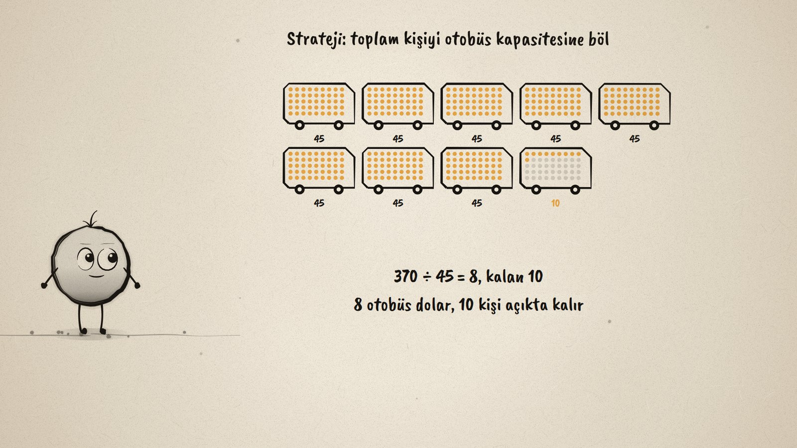
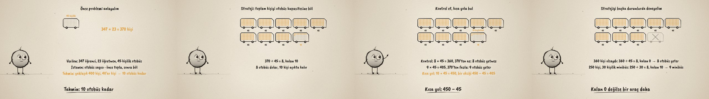

# Kaç Otobüs? · Solving Problems with Natural Numbers

**▶ Tarayıcıda izleyin / Watch in the browser:** https://hakanatas.github.io/kac-otobus/ 
**⬇ MP4 + altyazılar / MP4 + subtitles:** [Releases](https://github.com/hakanatas/kac-otobus/releases) 
**✎ Kullanılan istem / The prompt behind it:** [PROMPT.md](PROMPT.md) 
**🎞 Bütün filmler / All films:** [Nokta'nın Filmleri](https://hakanatas.github.io/nokta-filmleri/?sinif=5)

> **TR —** 5. sınıf matematik "Sayılar ve Nicelikler" temasındaki MAT.5.1.2 öğrenme çıktısı için hazırlanmış, tamamen JavaScript ile çizilen 92 saniyelik mürekkep animasyonu. Okul gezisine 347 öğrenci ve 23 öğretmen katılacak, otobüsler 45 kişilik: kaç otobüs gerekir? Verilenler ve istenen belirleniyor, önce toplam kişi bulunuyor (347 + 23 = 370). Tahmin: yaklaşık 400 kişi, 40'ar kişi, 10 otobüs kadar. Çözüm: 370 ÷ 45 = 8, kalan 10; otobüsler koltuk koltuk doluyor, 8'i tam doluyor, 10 kişi açıkta kalıyor, bu yüzden 9 otobüs. Kontrol: 8 × 45 = 360 yetmez, 9 × 45 = 405 yeter; kısa yol: 10 × 45 = 450, bir eksiği 405. Strateji genelleniyor ve sınanıyor: 360 kişi olsaydı kalan 0, 8 otobüs yeterdi; 250 kişi ve 30 kişilik minibüslerle 9 minibüs. Kural: kalan 0 değilse bölüme 1 eklenir. Altyazılar Türkçe, İngilizce ya da ikisi birlikte seçilebilir.

A 92-second ink animation for **5th-grade maths**. Nokta, the ink character from [The Learning Ink](https://github.com/hakanatas/the-learning-ink), is the guide again. The buses fill seat by seat from one running count of people (`buses` in `scenes/scene1.js`), so the numbers under the buses, the 10 left over and the 35 empty seats all come from the same count; when the count drops to 360, the ninth bus empties by itself.

## Learning outcome

MEB, Türkiye Yüzyılı Maarif Modeli, Ortaokul Matematik, 5th grade, "Sayılar ve Nicelikler" theme:

**MAT.5.1.2. Doğal sayılar ve işlemler içeren gerçek yaşam problemlerini çözebilme**
- a) Problemin içerdiği sayı ve işlem bileşenlerini belirler.
- b) Problemde verilenler ile istenenlerin gerektirdiği işlemler arasındaki ilişkiyi belirler.
- c) Problem bağlamıyla ilişkili verilenleri uygun matematiksel temsillere dönüştürür.
- ç) Problemi matematiksel temsiller kullanarak kendi ifadeleri ile açıklar.
- d) Problemin sonucuna ilişkin tahminde bulunur ve işlemleri gerçekleştirmek için stratejiler geliştirir.
- e) Belirlenen strateji veya stratejileri çözüm için uygular.
- f) Çözüm yollarını kontrol eder ve çözüme ulaştırmayan stratejiyi değiştirir.
- g) Problemin çözümü için kullandığı veya geliştirdiği stratejileri gözden geçirerek kısa yolları değerlendirir.
- ğ) Kullandığı strateji veya stratejileri farklı problemlerin çözümlerine geneller.
- h) Genellemenin geçerliliğini matematiksel örneklerle değerlendirir.

## Scenes

| # | Time | Scene | What happens | Outcome |
|---|---|---|---|---|
| 1 | 0–10 s | Okul gezisi | 347 pupils, 23 teachers, buses of 45: how many buses? | a |
| 2 | 10–28 s | Problemi anla | Given and asked; 347 + 23 = 370; estimate about 10 buses. | a, b, c, ç, d |
| 3 | 28–46 s | Böl | 370 ÷ 45 = 8 remainder 10: eight full buses and one more, 9. | e |
| 4 | 46–62 s | Kontrol ve kısa yol | 8 × 45 = 360 is not enough, 9 × 45 = 405 is; shortcut 450 − 45. | f, g |
| 5 | 62–80 s | Genelle | 360 people need only 8; 250 people in minibuses of 30 need 9; add 1 only if there is a remainder. | ğ, h |
| 6 | 80–92 s | Aklında kalsın | Identify, estimate, divide, check; don't forget the remainder. | a–h |

## Running it

- **Preview:** double-click `index.html` (it works offline).
- **MP4:** run `npm install` once, then `npm run export -- --format=horizontal --captions=tr`.
- **Subtitles and narration:** `npm run srt` writes `out/captions_*.srt` and `narration_notes.txt`.
- **Editing:**
  - Caption text, timings and narration notes: `captions.js`
  - Everything on screen is drawn by `LI.world(t)` in `scenes/scene1.js` (the buses and their seats, the counts, the words); the other scenes only set the camera.
  - Nokta's poses: `src/draw/film.js`; layout for 16:9 and 9:16: `src/draw/kd.js`

It uses the same engine as The Learning Ink: `renderFrame(t)` as a pure function of time, seeded randomness, and frame-by-frame export.

## Lisans · License

**TR —** Bu film ve kodu [Creative Commons Atıf-GayriTicari 4.0 Uluslararası (CC BY-NC 4.0)](https://creativecommons.org/licenses/by-nc/4.0/deed.tr) lisansıyla paylaşılır. Ticari olmayan her amaçla (derste, okulda, eğitim materyalinde) kopyalayabilir, paylaşabilir ve değiştirebilirsiniz; ancak **kaynak göstermek zorunludur**: eser sahibinin adı ve bu deponun bağlantısı belirtilmeden kullanılamaz. Ticari kullanım (satış, ücretli ürün ya da yayın) için izin alınmalıdır.

**EN —** This film and its code are licensed under [Creative Commons Attribution-NonCommercial 4.0 International (CC BY-NC 4.0)](https://creativecommons.org/licenses/by-nc/4.0/). You may copy, share and adapt them for non-commercial purposes, but **attribution is required**: they may not be used without crediting the author and linking to this repository. Commercial use requires permission.

Atıf örneği / Required credit: *“Kaç Otobüs?”, Hakan Ataş, Nokta'nın Filmleri — https://github.com/hakanatas/kac-otobus — CC BY-NC 4.0*
